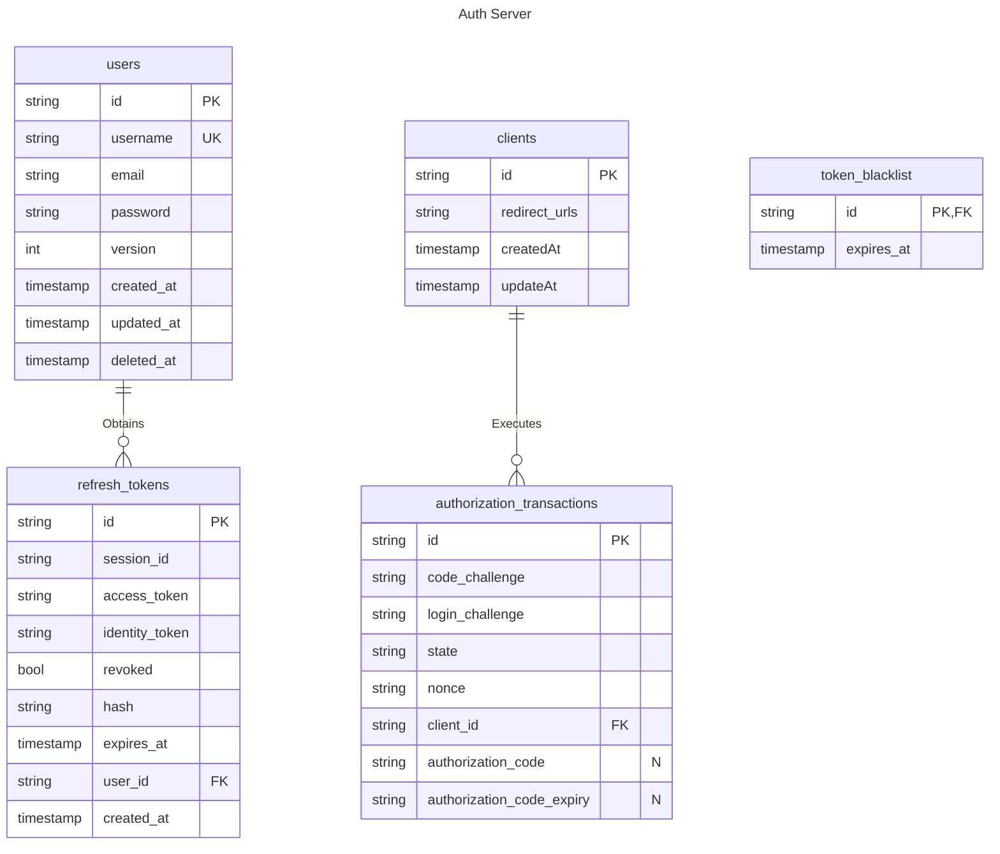

# Entity Relationship Diagrams

## Token blacklist

Contains IDs (jti) of the Access and Identity tokens (JWT) until they expire. The `expires_at` column is calculated based on the validatity time for the Access or Identity token in combination with the created time of the Refresh token. After the expiration time has reached, the entry is removed.

## Authorization Transaction

The `nonce` is used for the `nonce` claim of the Identity token. This value is generated by the client that initializes the Authorization flow.
