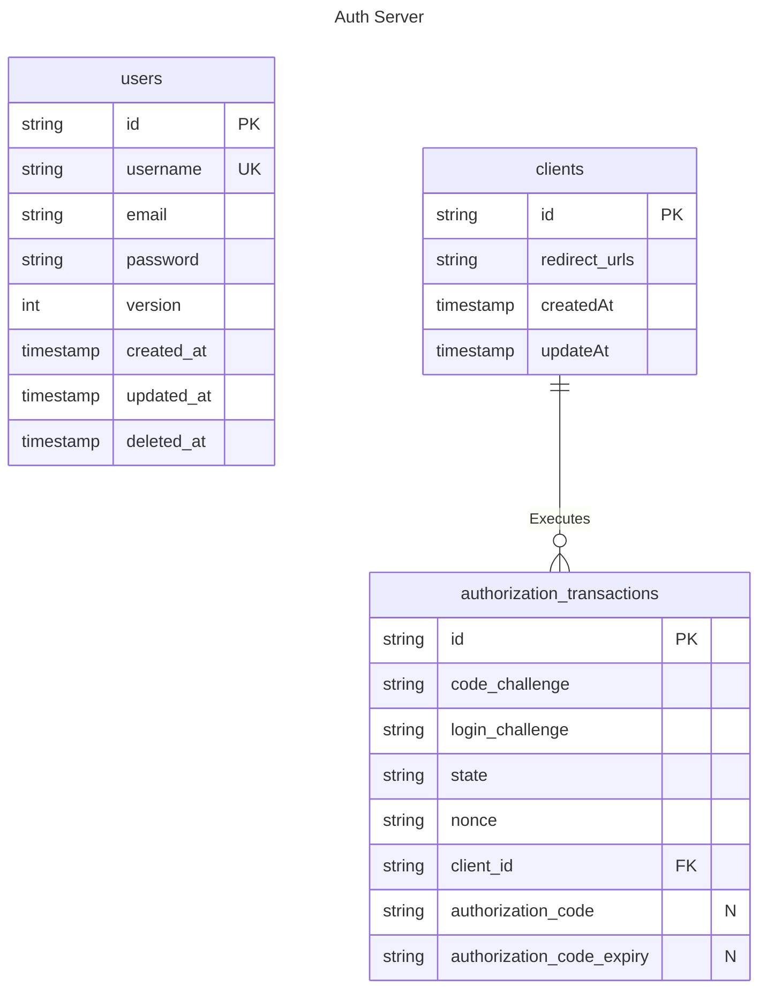

# Entity Relationship Diagrams

## Authorization Transaction

The `nonce` is used for the `nonce` claim of the Identity token. This value is generated by the client that initializes the Authorization flow.
