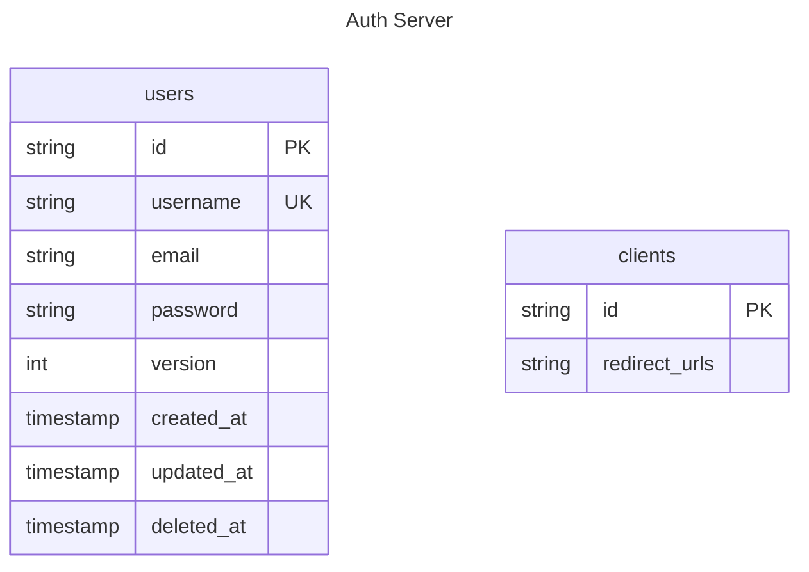

# Entity Relationship Diagrams

```mermaid
---
title: Auth Server
---
erDiagram
    users {
        string id       PK
        string username UK
        string email
        string password
        
        int version

        timestamp created_at
        timestamp updated_at
        timestamp deleted_at
    }
    
    clients {
        string id               PK
        string redirect_urls
    }
```
